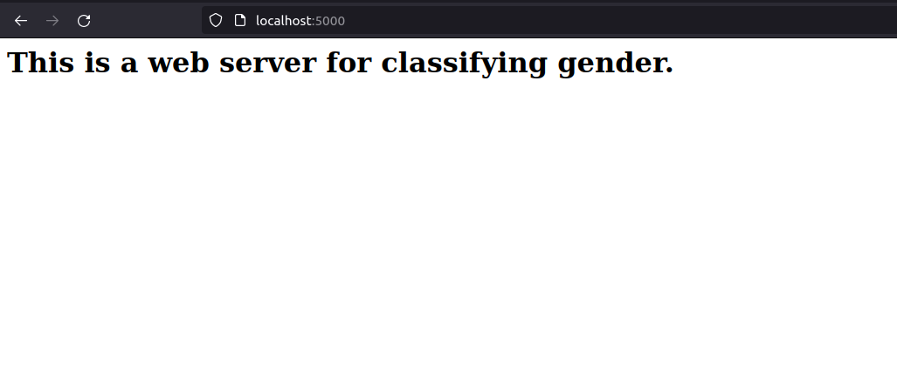

# IOT Assignment

Ensure you have prerequisites by running `pip install -r requirements.txt` 

This is a simple Flask application. To run this app, type python run `python app.py` into your command prompt. To check whether your server is up and running, go to https://localhost:5000 and you should see this:

Type run `python app.py --train` to train the model from scratch

The following API(s) are supported:
- `POST /predict` - Run inference on gender based on image (pixel value 0-255)
	- Image in request body's `image_data` field
